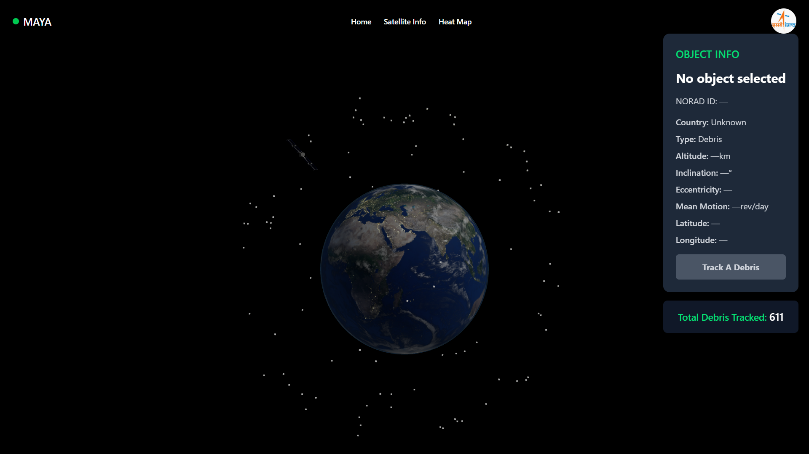

# 🌌 MAYA – Space Debris Tracker



**MAYA** is a real-time, 3D space debris tracking web application visualizing **ISRO satellites**, debris, and potential orbital collisions using TLE data. It aims to support research and awareness around space sustainability.

---

## 🚀 Features

- 🌍 Real-time interactive **3D Earth Model**
- 🛰️ 3D **Satellite Model** with smooth rotation
- 🛰️ **Real Orbit Visualization** of **ISRO GSAT-7 (Rukmini)** using live TLE data
- 🧠 Dynamic debris tracking with **NORAD ID integration**
- ⚠️ Real-time **collision detection**
- 🔔 **Alerts** upon predicted collisions
- 🔥 **Heatmaps** based on dense TLE data regions

---

## 🧪 Tech Stack

- ⚛️ React + JSX
- 🎨 Tailwind CSS
- 🛰️ Satellite.js + TLE Parser
- 🌐 Three.js + @react-three/fiber + drei
- ⚡ Vite (for fast bundling and dev server)

---

## 🛠️ Getting Started

1. To run the project locally:

```bash
    git clone https://github.com/Ani008/Maya.git
```


2. Navigate into the project directory:
    
```bash   
    cd Maya
```


3. Install dependencies:
    
```bash   
    npm install
```


4. Start the development server:
    
```bash   
    npm run dev
```


Open your browser and visit http://localhost:5173 to view the app.

## Contributing

